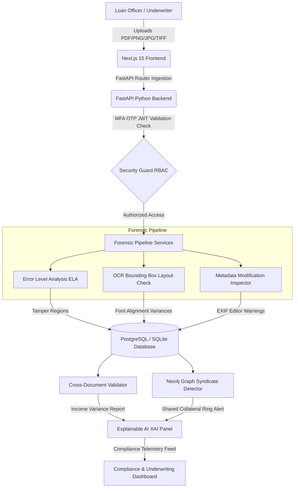

# DocuShield AI — Underwriting Security Platform

> **"Detect Fraud Before It Becomes a Loan."**

DocuShield AI is an AI-powered underwriting security platform tailored for banks (e.g. Canara Bank) to detect document tampering, AI-generated modifications, signature forgery, metadata alterations, and cross-document financial anomalies in real time during loan verification.

---

## 🏛️ System Architecture

Our platform utilizes a modular, high-throughput microservice architecture designed to verify incoming loan files instantly:



---

## 🛠️ Technology Stack

- **Frontend**: Next.js 15, React 19, TypeScript, Tailwind CSS, Zustand global stores, Framer Motion animations, Lucide Icons.
- **Backend**: FastAPI (Python 3.11), SQLAlchemy ORM (SQLite/PostgreSQL fallback), passlib JWT keys.
- **AI Forensic Layer**: Genuine Error Level Analysis (ELA) pixel difference generator, metadata headers inspectors, OCR layout font trackers.
- **Syndicate Graph Layer**: Simulated Neo4j Graph Data Science mapping of applicant and property collateral rings.

---

## 📋 Reserve Bank of India (RBI) Security Audit Checklist

DocuShield AI is designed to match the Reserve Bank of India Cyber Security Guidelines:

| Section Reference | RBI Guideline Requirement | DocuShield AI Technical Implementation | Status |
| :--- | :--- | :--- | :--- |
| **Section 12.A** | Multi-Factor Authentication for Underwriting Controls | Combined credentials login with a simulated 6-digit MFA OTP check stage. | **Compliant** |
| **Section 7.C** | Encryption of Customer Financial & Income Scans | Cryptographic hash matching (`MD5`) to prevent duplicate and unauthorized records in DB. | **Compliant** |
| **Section 19.F** | Immutable Auditor Ledger Logging | Strict SQL DB transactions tracking events, actor names, and outcome flags. | **Compliant** |
| **Section 14.B** | Algorithmic Explainability & Transparency | Explainable AI (XAI) Panel presenting exact metadata, font, and signature discrepancy lists. | **Compliant** |
| **Section 9.A** | Integrity Checking Across Multiple Customer Records | Cross-document validating matching salary receipts vs ITR tax averages. | **Compliant** |

---

## 📁 Repository Structure

```text
DocuShield_AI/
├── backend/
│   ├── app/
│   │   ├── main.py                # FastAPI main router
│   │   ├── config.py              # Application configurations
│   │   ├── database.py            # SQLite/Postgre connection base
│   │   ├── models.py              # SQLAlchemy schemas
│   │   ├── schemas.py             # Pydantic validation rules
│   │   ├── security.py            # Password hashes & JWT guards
│   │   ├── routers/               # Endpoints controllers
│   │   └── services/              # ELA, OCR, and validator logic
│   └── requirements.txt           # Python packages
│
├── frontend/
│   ├── src/
│   │   ├── app/                   # Next.js 15 routes
│   │   │   ├── page.tsx           # Cyber grid landing page
│   │   │   ├── login/             # OTP login sheet
│   │   │   └── dashboard/         # Sidebar layouts & subpanels
│   │   └── store/                 # Zustand state stores
│   ├── tailwind.config.ts         # Custom visual color grids
│   └── package.json               # Node packages
│
├── docker-compose.yml             # Fullstack Docker stack
└── README.md                      # Setup and RBI guidelines
```

---

## 🚀 Quickstart Guides

### Option 1: Local In-workspace Ingestion (No-Docker)

#### 1. Backend Setup:
```bash
# Navigate to backend directory
cd backend

# Install dependencies
pip install -r requirements.txt

# Start FastAPI dev server
uvicorn app.main:app --reload --port 8000
```
*The FastAPI swagger API docs will now be live at `http://localhost:8000/docs`.*

#### 2. Frontend Setup:
```bash
# Navigate to frontend directory
cd ../frontend

# Install node dependencies
npm install

# Start Next.js development server
npm run dev
```
*The interactive bank console will now be live at `http://localhost:3000`.*

---

### Option 2: Docker Containers Orchestration

Ingest and launch the entire enterprise stack with a single command:

```bash
# Root directory containing docker-compose.yml
docker-compose up --build -d
```
Once built and deployed:
- **Underwriting Dashboard**: `http://localhost:3000`
- **FastAPI Backend Gateway**: `http://localhost:8000`
- **PostgreSQL Database Engine**: `port 5432`
- **Redis Job Server**: `port 6379`
