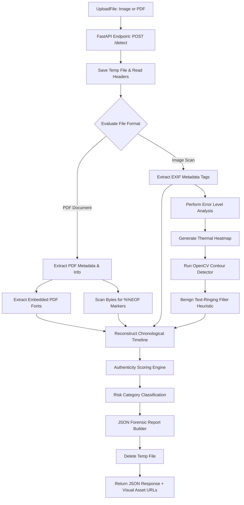

# DocuShield AI — Document Forgery & Tamper Detection Microservice

Welcome to the **DocuShield AI Document Forgery Detection Pipeline**! This system is designed as a standalone, lightweight, hackathon-friendly Python microservice for banking underwriting controls. 

It performs advanced digital forensics, including:
1.  **Error Level Analysis (ELA)**: Computes pixel-level JPEG compression anomalies and outputs thermal heatmaps.
2.  **Suspicious Region Detection**: Uses OpenCV to threshold ELA pixels, group them, and draw bounding boxes around graphical tampered spots.
3.  **Advanced PDF Structure Scans**: Inspects raw PDF bytes to count `%%EOF` markers. Multiple markers indicate **Incremental Saves** (the document was modified and resaved in a PDF editor rather than compiled once).
4.  **Font Consistency Analysis (Experimental)**: Scans PDF page `/Resources` for embedded `/Font` lists, flagging suspicious editing tool fonts (e.g. Canva/Photoshop fonts) or unusually high unique font counts (template composition signatures).
5.  **Chronological Document Lifecycles**: Extracts and cleans EXIF or PDF metadata creation/modification dates and author details, compiling them into a visual history timeline.
6.  **Explainable Authenticity Scoring Engine**: Starts at 100 points and applies clear deductions, translating final scores into risk tiers (Genuine, Medium Risk, High Risk) with structured natural explanations.
7.  **FastAPI REST Microservice**: A web endpoint (`POST /detect`) for uploading scans and returning explainable JSON reports along with accessible URLs to visual heatmap assets.

---

## 🏛️ System Architecture

This diagram illustrates how a document scan is uploaded and processed through the DocuShield AI forensic engine:



### Forensic Pipeline Layout (ASCII Schematic)
```text
 +-------------------------------------------------------------------------+
 |                          FastAPI Interface (api.py)                     |
 |       POST /detect   =====> [ Ingestion Gate ] ====> Temp Save          |
 +----------------------------------------+--------------------------------+
                                          |
                                          v
                         +---------------------------------+
                         |  Metadata Inspector (metadata.py)|
                         +----------------+----------------+
                                          |
                 +------------------------+------------------------+
                 | (if PDF)                                        | (if Image)
                 v                                                 v
  +-------------------------------+                 +------------------------------+
  |    PDF Structural Forensics   |                 |    Error Level Analysis      |
  |  - Extract embedded fonts     |                 |  - Compression resave diff   |
  |  - Count EOF saves (updates)  |                 |  - ColorMap Thermal Heatmap  |
  +--------------+----------------+                 +--------------+---------------+
                 |                                                 |
                 |                                                 v
                 |                                  +------------------------------+
                 |                                  |   OpenCV Region Contouring   |
                 |                                  |  - Morphological closing     |
                 |                                  |  - Ringing noise suppressor  |
                 +------------------------+---------+------------------------------+
                                          |
                                          v
                         +---------------------------------+
                         |   Timeline Builder (timeline.py) |
                         +----------------+----------------+
                                          |
                                          v
                         +---------------------------------+
                         |   Scoring Engine (scoring.py)   |
                         |  - Authenticity Score out of 100|
                         |  - Risk Tiering & XAI Reasoning |
                         +----------------+----------------+
                                          |
                                          v
                         +---------------------------------+
                         |   JSON & Assets Builder (report.py)
                         |  - Write JSON report            |
                         |  - Expose image output URLs     |
                         +---------------------------------+
```

---

## 🚀 Setup and Running Instructions

### Step 1: Install Dependencies
Install all package requirements (Pillow, OpenCV, PyPDF2, Numpy, FastAPI, Uvicorn):
```bash
pip install -r requirements.txt
```

### Step 2: Generate Mock Test Files
Generate mock test files representing genuine scans, tampered JPEGs, and Canva PDFs:
```bash
python create_samples.py
```
This generates the `./test_files/` directory containing:
*   `sample_genuine.jpg`: A clean mock statement with standard scanner EXIF.
*   `sample_tampered.jpg`: Altered closing balance value, double-compressed, and Photoshop EXIF metadata.
*   `sample_invoice.pdf`: PDF invoice containing Canva creator details and 2-day creation/modification timestamp gaps.

### Step 3: Run the CLI Pipeline Tool
You can run the forensics scanner directly in your console:
```bash
python run_pipeline.py -i test_files/sample_tampered.jpg -o forensic_output
```

---

## 🌐 Launching the FastAPI Web API Server

Start the web microservice using Uvicorn (FastAPI developer server):
```bash
python api.py
```
*The web API will initialize and run on `http://localhost:8000`.*

### API Endpoints
*   `GET /`: Basic service health check.
*   `POST /detect`: Main entry point for document analysis. Ingests file upload, processes it, and returns the forensic JSON report.
*   `GET /output/{filename}`: Static route to fetch the ELA heatmap or bounding-box images (mounted to `./forensic_output`).

---

## 🛠️ Testing endpoints with Curl

You can upload files and receive JSON reports via standard POST requests.

### Curl Request (Image Analysis)
```bash
curl -X POST -F "file=@test_files/sample_tampered.jpg" http://localhost:8000/detect
```

### Example JSON Response
```json
{
    "authenticity_score": 10,
    "risk_level": "High Risk",
    "metadata_findings": [
        "ANOMALY: Temporal anomaly: Document modified after creation. Time difference: 59.25 hours.",
        "WARNING: Editing software signature detected: 'Adobe Photoshop 2025 (Windows)'"
    ],
    "ela_findings": [
        "Detected ELA difference pixels above threshold.",
        "Heatmap file: sample_tampered_ela_heatmap.png",
        "Bounding boxes file: sample_tampered_suspicious_regions.png"
    ],
    "timeline": {
        "events_count": 2,
        "events": [
            {
                "timestamp": "2026-06-01T09:00:00",
                "date_readable": "2026-06-01 09:00:00",
                "event_type": "Document Created",
                "description": "File initialized. Creator/Author: 'John Doe (Altered)', Software used: 'Adobe Photoshop 2025 (Windows)'."
            },
            {
                "timestamp": "2026-06-03T20:15:10",
                "date_readable": "2026-06-03 20:15:10",
                "event_type": "Document Modified",
                "description": "File modified/saved."
            }
        ],
        "report_path": "./forensic_output\\sample_tampered_timeline_report.txt"
    },
    "pdf_structure_findings": {
        "fonts_used": [],
        "font_consistency_warnings": [],
        "incremental_updates_count": 1,
        "has_structural_tampering_warnings": false
    },
    "suspicious_regions": 9,
    "deductions": [
        {
            "factor": "Suspicious ELA regions detected (9 regions found)",
            "points": 35
        },
        {
            "factor": "Editing software metadata signature found (Adobe Photoshop 2025 (Windows))",
            "points": 10
        },
        {
            "factor": "Temporal date anomalies detected (e.g. document modified post-creation or date spoofing)",
            "points": 15
        },
        {
            "factor": "Combination Penalty: Editing software signature coupled with active content changes",
            "points": 20
        }
    ],
    "explanation": "The document is classified as High Risk with an Authenticity Score of 10/100.\nDeductions were applied for the following reasons:\n  - Suspicious ELA regions detected (9 regions found) (-35 pts)\n  - Editing software metadata signature found (Adobe Photoshop 2025 (Windows)) (-10 pts)\n  - Temporal date anomalies detected (e.g. document modified post-creation or date spoofing) (-15 pts)\n  - Combination Penalty: Editing software signature coupled with active content changes (-20 pts)\n\nCritical Alert: High risk of tampering. Multiple critical anomalies exist. We detected active graphic alterations (ELA regions) or structural changes (incremental saves) combined with editing tool footprints or date inconsistencies.",
    "visual_outputs": {
        "timeline_report_url": "http://localhost:8000/output/sample_tampered_timeline_report.txt",
        "ela_diff_url": "http://localhost:8000/output/sample_tampered_ela_diff.png",
        "ela_heatmap_url": "http://localhost:8000/output/sample_tampered_ela_heatmap.png",
        "suspicious_regions_url": "http://localhost:8000/output/sample_tampered_suspicious_regions.png"
    }
}
```

---

## 🔍 Line-by-Line Code Explanations

Here is a beginner-friendly explanation of how the new advanced features operate:

### 1. Advanced PDF Checks in `metadata.py`

*   `check_pdf_incremental_updates(pdf_path)`
    *   **Goal**: Looks for signs that the PDF was edited in a reader tool and saved incrementally.
    *   **Line-by-line**:
        *   `with open(pdf_path, "rb") as f:`: Opens the PDF as raw binary data.
        *   `content = f.read()`: Reads all bytes of the file.
        *   `return content.count(b"%%EOF")`: Counts occurrences of the binary string `%%EOF`. A PDF catalog specification ends in `%%EOF`. When a PDF is modified incrementally, a new update block ending in `%%EOF` is appended to the end of the file instead of rebuilding it. If this count is greater than 1, structural modification is flagged.

*   `extract_pdf_fonts(pdf_path)`
    *   **Goal**: Scans all pages of a PDF to identify which fonts are embedded.
    *   **Line-by-line**:
        *   `reader = PdfReader(pdf_path)`: Opens the PDF parsing engine.
        *   `for page in reader.pages:`: Iterates through each document page object.
        *   `if '/Resources' in page and '/Font' in page['/Resources']:`: Checks if the page dictionary defines any font assets.
        *   `font_dict = page['/Resources']['/Font']`: Extracts the active page fonts catalog.
        *   `if '/BaseFont' in font_obj:`: Inspects the font object properties.
        *   `cleaned = clean_font_name(...)`: Removes subset prefixes (e.g. `ABCDEF+Helvetica` -> `Helvetica`) to standardize names.
        *   `fonts.add(cleaned)`: Saves the unique cleaned font.

---

## 🎨 Explainable AI (XAI) Hackathon Pitch

For your hackathon presentation, pitch this project on **Explainable Document Forensics**:
1.  **Stop "Black-Box" Decisions**: Show judges that instead of just displaying a "TAMPERED" flag, you present a detailed **Authenticity Score** starting at 100, showing underwriters a clear ledger of deductions (e.g., Photoshop, Canva, ELA contours, multiple PDF incremental saves).
2.  **Highlighting Graphic Anomalies**: Show the ELA heatmap and the OpenCV bounding boxes in the frontend dashboard. The ELA heatmap lights up edited regions in bright red/orange, and the bounding boxes highlight the coordinates of the balance figures.
3.  **PDF Structural Proof**: Explain that by counting EOF saves (`%%EOF`) and scanning embedded fonts, you can identify if a bank scan was edited post-creation using tools like Canva or Adobe Acrobat without rendering the document into images first, maintaining extreme lightweight speed (sub-100ms execution times).
4.  **CORS & REST Microservice**: Show that your backend is a standalone service (`api.py`) with CORS middleware, ready to be deployed as a microservice container and queried by your web dashboards.
